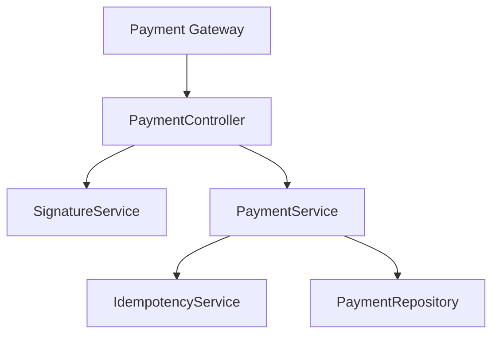
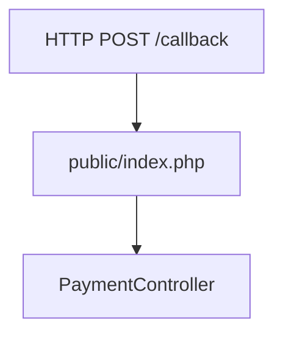
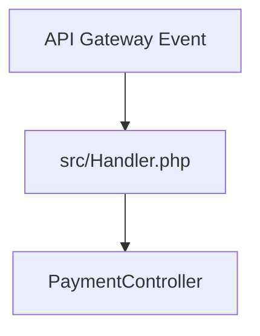

# Architecture

## Overview

This project is organized around a simple callback-processing pipeline designed to keep signature validation, business validation, and persistence concerns separated.

## Components

- `PaymentController`: entry point for HTTP and Lambda events. It extracts headers, verifies the signature, decodes JSON, and delegates business processing.
- `SignatureService`: validates the raw callback body using the configured RSA public key and `OPENSSL_ALGO_SHA512`.
- `PaymentService`: validates required business fields, normalizes the payload, and coordinates idempotent processing.
- `IdempotencyService`: checks whether a callback for the same `merchant_operation_number` was already processed.
- `PaymentRepository`: persists processed payments. The current implementation is in-memory and should be replaced in production.

## Diagram

## Execution Paths

### Local / VPS

### AWS Lambda

## Production Note

For production-grade idempotency and durability, replace the in-memory `PaymentRepository` with DynamoDB, RDS, or another persistent store shared across instances.
