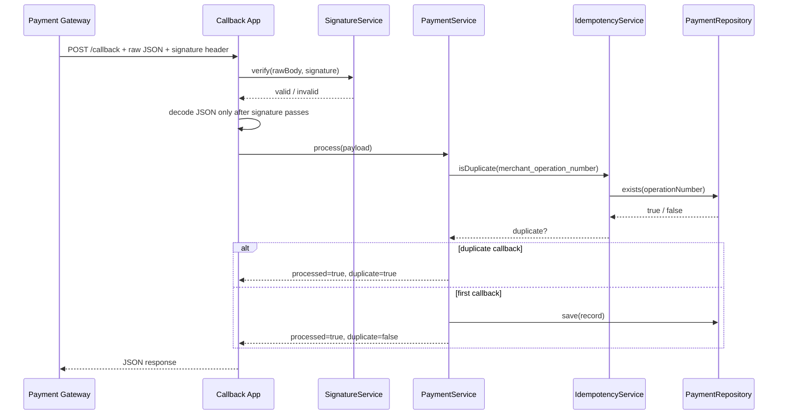

# Callback Flow

## End-to-End Flow

## Validation Rules

1. Read the request body without mutating whitespace, ordering, or formatting.
2. Extract the `signature` header case-insensitively.
3. Base64-decode the signature.
4. Verify with `openssl_verify(..., OPENSSL_ALGO_SHA512)`.
5. Decode JSON only after the signature is valid.
6. Validate required business fields.
7. Check idempotency using `merchant_operation_number`.
8. Persist the transaction outcome.

## Failure Modes

- Missing signature: return `400`.
- Invalid Base64 signature: return `400`.
- Signature mismatch: return `400`.
- Malformed JSON: return `400`.
- Invalid business fields: return `400`.
- Unexpected runtime error: return `500`.
